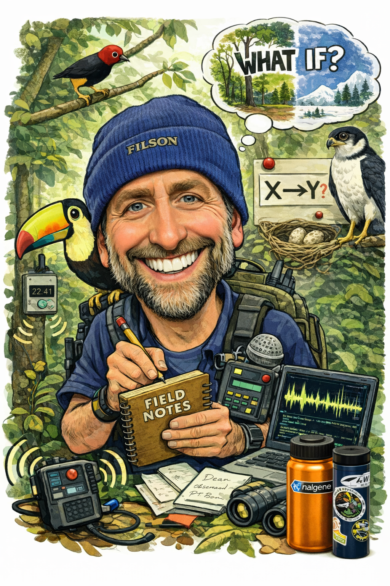

------------------------------------------------------------------------

## Working with me on thesis and dissertation committees

::::: columns
::: {.column width="70%"}
I am very happy to serve on anyone's thesis/dissertation committee, especially for students interested in causal inference, behavioral ecology, and quantitative approaches to complex field data. I am committed to working with your advisor to help you make the progress you want. However, you should be aware that my approach to ecological inference is grounded in structural causal modeling (SCM) and a very structured estimand-first workflow.

------------------------------------------------------------------------

What does this mean? Ecological research often centers on identifying and filling gaps in collective knowledge. My perspective, which is backed up by many formal scientific critiques over the last 10 years, is that many of these gaps arise not from a lack of data about specific systems, but from analyses that are not tied to clearly defined causal questions. That is, when the inferential target is ambiguous or ill-defined (as often happens in AIC multi-model selection), seemingly objective modeling choices destroy ecologists' causal assumptions and silently answer very different and very unanticipated questions, making it difficult to determine what has actually been learned.
:::

::: {.column width="30%"}

:::
:::::

------------------------------------------------------------------------

This perspective often differs from more traditional approaches in ecology, including “kitchen-sink” modeling strategies (e.g., including many covariates without a clear causal target, conditioning on mediators, or using model selection to infer variable importance). At the same time, nearly all ecological studies --including most of those using these approaches-- use causal verbiage to interpret results, even when analyses are not aligned with explicit causal questions. My perspectives are therefore often at odds with purportedly "causal" frameworks like Structural Equation Modeling (SEM) which are great but unfortunately often applied in ways that break causal assumptions and obscure original questions. This is all to say that my transparent and literature-backed feedback to you may challenge common analytical practices. At times, my perspective may differ greatly from the guidance provided by your advisor(s) or other committee members. And that is alright! We should have differing perspectives based on our expertise with field work, different taxa, etc.

When serving on a committee, you can expect me to:

-   ask for a very clearly defined causal question (what effect you are trying to estimate)
-   ask for formal literature and/or data-driven representation of your causal assumptions (e.g., a Directed Acyclic Graph, or DAG)
-   emphasize transparent alignment between your causal question and your statistical model(s)
-   be very candid about potential biases introduced by model specification

This is **not** about enforcing a single “correct” way to analyze your data (e.g. epistemic gate-keeping). It is about about ensuring that your ecological inference is logically associated with the specific questions that you asking.

If you are considering asking me to serve on your committee, you should be very open to:

-   revisiting the framing of your original research questions (with respect to what effects are identifiable)
-   thinking carefully about all causal assumptions (even ones that may influence your system but were not measured)\
-   engaging in difficult discussions that may push against standard practices in the field of ecology

If my perspective and these approaches sound useful (or at least interesting), I’m very happy to be involved as a member of your thesis/dissertation committee!

## A short reading list (some of what I would recommend in my capacity as a committee member)

Below are some of the papers that I think every graduate student in ecology (especially behavioral ecology) should read. These are some examples of papers I would recommend for your oral/written exams. Some are effectively zombie ideas, but they help provide some historical context. These are in no particular order (except the first paper, which is what everyone should read):

-   **Franks *et al.* (2025).** Ecology needs a causal overhaul. *Biological Reviews*.\
    Ecology must adopt explicit causal inference frameworks beyond statistical associations.

-   **Sih *et al.* (2004).** Behavioral syndromes: an ecological and evolutionary overview. *Trends in Ecology & Evolution*.\
    Correlated behaviors constrain plasticity and shape ecological, evolutionary outcomes.

-   **Wong and Candolin. (2015).** Behavioral responses to changing environments. *Behavioral Ecology*.\
    Behavioral plasticity mediates species persistence under rapid anthropogenic environmental change.

-   **Chave. (2013).** The problem of pattern and scale in ecology: what have we learned in 20 years? *Ecology Letters*.\
    Ecological processes vary across scales; linking pattern and process remains central.

-   **Duckworth. (2009).** The role of behavior in evolution: a search for mechanism. *Evolutionary Ecology*.\
    Behavior can drive or inhibit evolution depending on mechanisms and context.

-   **Murtaugh. (2007).** Simplicity and complexity in ecological data analysis. *Ecology*.\
    Simpler analyses often outperform complex models for clarity and reproducibility.

-   **Hobbs and Hilborn.** (2006). Alternatives to statistical hypothesis testing in ecology. *Ecological Applications*.\
    Likelihood and Bayesian methods enable richer inference than traditional hypothesis testing.

-   **Hurlbert. (1984).** Pseudoreplication and the design of ecological field experiments. *Ecological Monographs*.\
    Improper replication undermines inference; experimental design must match hypotheses.

-   **Laland *et al.* (2016).** An introduction to niche construction theory. *Evolutionary Ecology*.\
    Organisms modify environments, feeding back to influence evolutionary processes.

-   **Levin et al. (1992).** The problem of pattern and scale in ecology. *Ecology*.\
    Ecological patterns emerge from scale-dependent processes requiring cross-scale integration.

-   **McEwen et al. (2003).** The concept of allostasis in biology and biomedicine. *Hormones and Behavior*.\
    Organisms maintain stability through change, balancing energy demands and stressors.

-   **Odling-Smee et al. (2013).** Niche construction theory: a practical guide for ecologists. *Quarterly Review of Biology*.\
    Environmental modification by organisms generates eco-evolutionary feedbacks and inheritance.

-   **Schank et al. (2009).** Pseudoreplication is a pseudoproblem. *Journal of Comparative Psychology*.\
    Critiques pseudoreplication doctrine, emphasizing context-dependent statistical inference and design.
