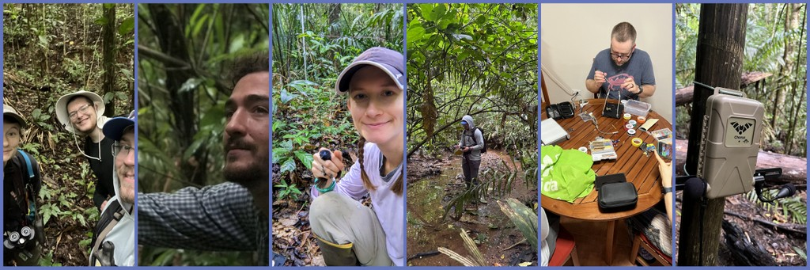

# Join the lab!

The Behavioral Complexity lab typically has 2-3 graduate students and 3-4 undergraduate students at any time. The Lab holds weekly lab meetings with its sister lab (the Tarwater Lab of Tropical Ecology and Behavior). Perks of being a lab member include, but are not limited to, gaining experience with grant writing, being able to attend lab meetings to discuss new work and progress, free coffee and tea in the lab, and some desk space to use for studying between classes.

<!-- New graduate students -->

::: {.details collapse="true"}

**Current opportunities for new Ph.D. and M.Sc. students**

*From Patrick Kelley--* I am not currently seeking Ph.D. or M.Sc. students. This is not for lack of interest but rather a lack of financial support. The one thing that keeps me up at night is the possibility of not being able to pay folks in my lab. So, I like to be very sure that anyone in my lab never has to experience the stress of not getting a paycheck. That said, if you have your own funding, I am more than happy to speak with you about opportunities. And I may even be able to provide a small bit of supplementary support for housing, field station fees, and equipment. Feel free to send me an email introducing yourself; at the very least, this is a good chance to meet someone new and interesting (you, not me). Please feel free to send the following to me via email:

-   A brief statement of your research interests and your previous experience. (Please ensure that this statement is relevant to what my lab does. Unfortunately, it’s necessary to ignore a large number of emails from folks who clearly have not read what I do.)
-   Your recent curriculum vitae (CV). (I do not need to read the usual business-like verbiage often included in a typical resume, the windbag cousin of the CV.)
-   A picture of a critter (or, better yet, an interaction between critters) at your favorite field site! (When I’m in the office, it is always fun to live vicariously through others!)

:::

<!-- Graduate RA -->

::: {.details collapse="true"}

**Current opportunities for Graduate Student Research Assistants**

*From Patrick Kelley--* If you are a graduate researcher who wants to gain new experience with projects in our lab, contact me. I welcomed two graduate students from the UW Department of Botany into my lab to work on programming projects; as Graduate Computing Scholars funded by UW's School of Computing they each received tuition, fees, and stipend for the academic year, and we had wonderful experiences working on new problems together!

:::

<!-- Undergrad -->

::: {.details collapse="true"}

**Current opportunities for Undergraduate students**

*From Patrick Kelley--* If you’re an undergraduate looking to get research experience, our lab offers lots of ways to get involved! Students who start with lab-based projects (video annotation, bioacoustics, etc.) may later join fieldwork opportunities in places like Panama or Hawaii. To learn more, send me an email with the following details:

-   Your recent curriculum vitae (CV).
-   A brief statement outlining the research topics that interest you and your reasons for choosing them.

:::

