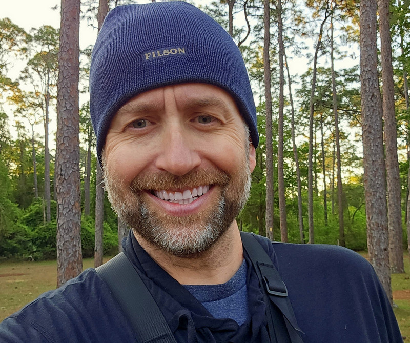
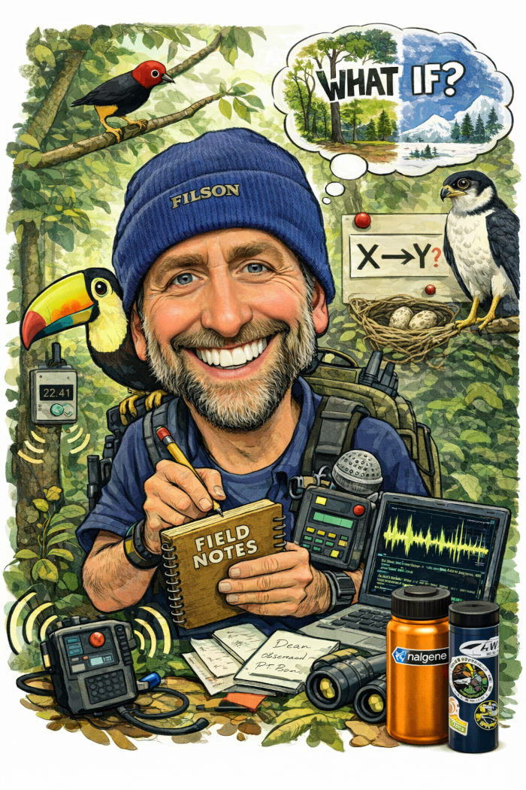

:::::: columns
::: {.column width="70%"}
# About Me (Patrick Kelley)

As a trained scientist with a Ph.D. in Animal Behavior, I am interested in any sort of complex animal behavior. The more difficult and complex an organism or a group of organisms are, the more interested I become. My interests and work have spanned multiple fields within behavioral ecology, including bioacoustics, plant-animal interactions, endocrinology, visual perception, telemetry, climatic modeling, movement ecology, and ecological simulations. I have conducted fieldwork across the U.S. and in Central and South America, including Panama, Brazil, and Ecuador. My main work has focused on the tropical forests of Panama, where I have studied the ecology of tropical birds since 2000, using advanced statistical methods to better understand information flow and ecological interactions.
:::

:::: {.column width="30%"}
::: top-space-wrapper
{width="100%"}
:::
::::
::::::

::: {.details collapse="true"}

**Education and Appointments (click to expand)**

**Education:**

-   University of California-Davis (Ph.D. Animal Behavior; advisor: John C. Wingfield)
-   Harvard (B.A. Biology)

**Postdoctoral Research Appointments:**

-   University of California, Berkeley
-   Florida State University
-   University of British Columbia

**Appointments:**

-   \[2018 - present\] Research Scientist (Fixed Term; full faculty and PI status), Univ. of Wyoming
-   \[2025 - 2026\] Faculty Fellow, School of Computing, Univ. of Wyoming
-   \[2023 - present\] Adjunct Faculty, School of Computing, University of Wyoming
-   \[2022 - present\] Research Associate, Smithsonian Tropical Research Institute
-   \[2013 - present\] Research Associate, Center for Tropical Studies (UCLA)

:::

::: {.details collapse="true"}

**Personal miscellany (click to reveal too much information)**

Dad twice over to two uncaged yahoos, an always-improving husband, fly-fisherman (freshwater and saltwater), fiercely anti-BS, ever-reverent Eagle Scout, college rower (6-seat or stroke, port-side), lover of simple and functional outdoor gear, data nerd, a pretty good shot with a 12-gauge and a .22 rifle (and, once upon a time, a .38), very amateur artist, collector of Silver/Bronze Age comic books, lover of colorful socks, tinkerer, son of a sin-eater Vietnam vet, Scotland-born, raised in coastal Georgia in a town smaller than Laramie. I’ve been sucker-punched by a Harpy Eagle; I've been an accommodating host to several tropical parasites, including one that ate a hole in my arm; Dengue and a couple of unknown diseases almost killed me; I've had my nose broken by a large branch that fell from the rainforest canopy (poor aim, some say); and I’m the only person I've ever known to have fallen into a human sewage cistern, which had been stewing for weeks in the tropical heat.

:::

::: {.details collapse="true"}

**Traditional academic bean-counting (click to expand)**

-   [Google Scholar Profile](https://scholar.google.com/citations?user=icU-Z0wAAAAJ&hl=en)
-   [Research Gate](https://www.researchgate.net/profile/J-Patrick-Kelley)

:::

# Teaching

I currently teach three courses per year at University of Wyoming (two during Fall term and one in January term):

-   Behavioral Ecology (ZOO-4415) ***or*** Introductory Biology (LIFE-1010) \[alternating Fall terms\]
-   Quantitative Analysis of Messy Data (ZOO-5500) \[once per year\]
-   Data Science Deep Dive ***or*** Calling BS in Our Data-driven World (Honors) \[alternative January terms\]

Past courses include:

-   Panama Field Course (WyoPanama): an ecology-based research course in January (led three times). Link to [WyoPanama 1.0 and 2.0](https://wyopanama.weebly.com/about.html) and [WyoPanama 3.0](https://wyopanama.weebly.com/). Link to [Facebook](https://www.facebook.com/wyopanama/).
-   Population Ecology (ZOO4400)

Other information: I am trained in [Universal Design in Learning (UDL)](https://teaching.uic.edu/cate-teaching-guides/inclusive-equity-minded-teaching-practices/universal-design-for-learning-udl/) best practices and am a strong proponent of Specifications Based Grading (links: [1](https://academictech.uchicago.edu/2025/07/28/specifications-grading-a-powerful-way-to-reflect-what-students-learn/), [2](https://idaltoona.psu.edu/2025/04/21/rethinking-grading-structures/), [3](https://pubs.acs.org/doi/10.1021/acs.jchemed.3c00473)) .

---

# M.S./Ph.D. committees: Interested in me serving on your committee?

::::: columns
::: {.column width="70%"}
I have served or chaired several committees, and I generally really love the amazing interactions. I am very happy to serve on anyone's thesis/dissertation committee, especially for those students interested in causal inference, behavioral ecology, and quantitative approaches to complex field data. I am committed to working with your advisor to help you make the progress you want. However, you should be aware that my approach to ecological inference is grounded in structural causal modeling (SCM) and a very structured estimand-first workflow. 

--- 

**What does this mean?** Ecological research often centers on identifying and filling gaps in collective knowledge. My perspective, which is backed up by many formal scientific critiques over the last 10 years, is that many of these gaps arise not from a lack of data about specific systems, but from analyses that are not tied to clearly defined causal questions. That is, when the inferential target is ambiguous or ill-defined (as often happens in AIC multi-model selection), seemingly objective modeling choices destroy ecologists' causal assumptions and silently answer very different and very unanticipated questions, making it difficult to determine what has actually been learned.
:::

::: {.column width="30%"}

:::
:::::

--- 

This perspective often differs from more traditional approaches in ecology, including “kitchen-sink” modeling strategies (e.g., including many covariates without a clear causal target, conditioning on mediators, or using model selection to infer variable importance). At the same time, nearly all ecological studies --including most of those using these approaches-- use causal verbiage to interpret results, even when analyses are not aligned with explicit causal questions. My perspectives are therefore often at odds with purportedly "causal" frameworks like Structural Equation Modeling (SEM) which are great but unfortunately often applied in ways that break causal assumptions and obscure original questions. This is all to say that my transparent and literature-backed feedback to you may challenge common analytical practices. At times, my perspective may differ greatly from the guidance provided by your advisor(s) or other committee members. And that is alright! We should have differing perspectives based on our expertise with field work, different taxa, etc. When serving on a committee, you can expect me to:

-   ask for a very clearly defined causal question (what effect you are trying to estimate)
-   ask for formal literature and/or data-driven representation of your causal assumptions (e.g., a Directed Acyclic Graph, or DAG)
-   emphasize transparent alignment between your causal question and your statistical model(s)
-   be very candid about potential biases introduced by model specification

This is **not** about enforcing a single “correct” way to analyze your data (e.g. epistemic gate-keeping). It is about ensuring that your ecological inference is logically associated with the specific questions that you asking.

If you are considering asking me to serve on your committee, you should be very open to:

-   revisiting the framing of your original research questions (with respect to what effects are identifiable)
-   thinking carefully about all causal assumptions (even ones that may influence your system but were not measured)\
-   engaging in difficult discussions that may push against standard practices in the field of ecology

If my perspective and these approaches sound useful (or at least interesting), I’m very happy to be involved as a member of your thesis/dissertation committee!
