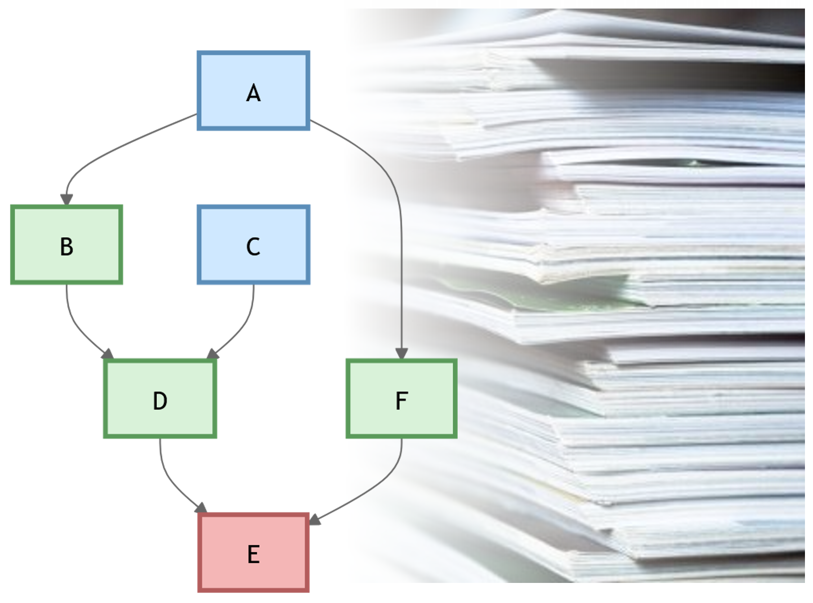
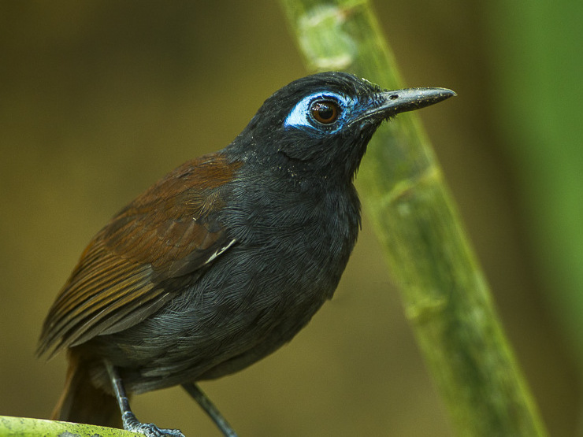
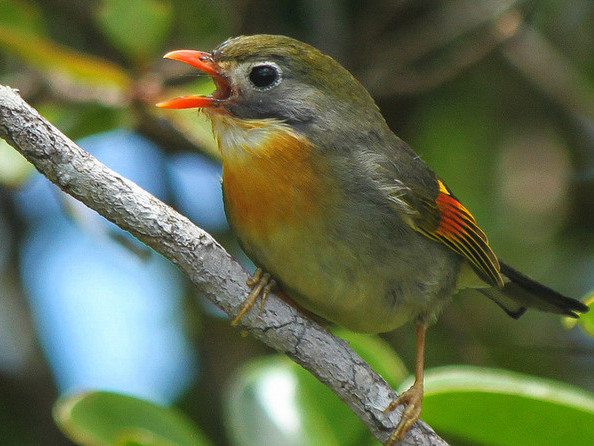
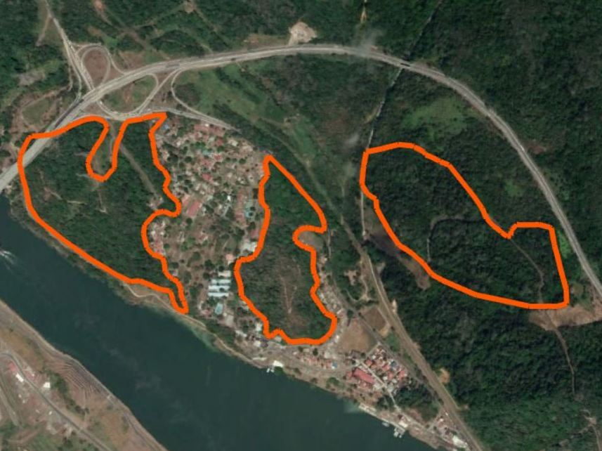
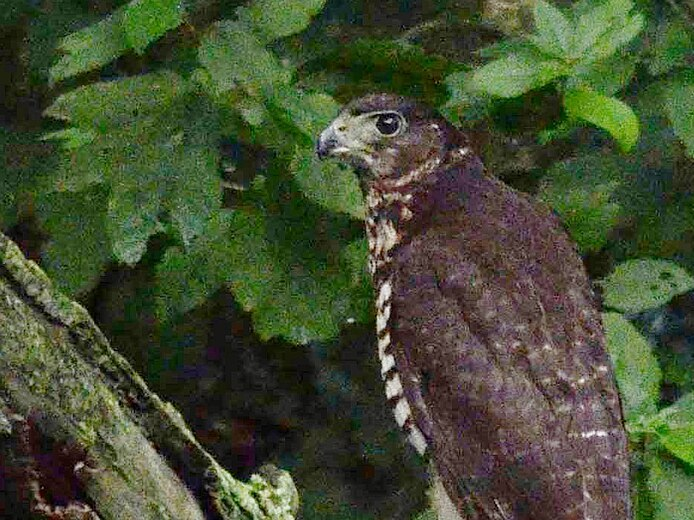

## Funding

The work of the Behavioral Complexity Lab and its members is only possible through the support of the following agencies, organizations, and programs. The BCL has brought in \>\$6.6M in grant funding.

::: {.callout-tip collapse=true icon=false}
## **Click to see the Lab's funding sources**

**Technology development (artifical intelligence and sensor fabrication)**

-   Microsoft Corporation
-   US Department of Defense
-   UW School of Computing
-   UW Center for Global Studies

**Hawaii VINE Project (2014 - present)**

-   SERDP (US Department of Defense, Department of Energy, and EPA)

**Panama PLUMAS Project (2014 - present)**

-   Smithsonian Tropical Research Institute
-   National Science Foundation
-   National Geographic
-   NASA
-   UW College of Agriculture, Life Sciences, and Natural Resources
-   UW Center for Global Studies

**Student grants (PI=PI as a student; S=students)**

- UW Biodiversity Institute (S)
- Wyoming Research Scholars Program (S)
- Laramie Audubon Society (S)
- American Ornithologists’ Society (and Union) (PI, S)
- UW Department of Zoology & Physiology (S)
- American Museum of Natural History (PI)
- Animal Behavior Society (PI, S)
- Smithsonian Tropical Research Institute (PI)
- Harvard College (PI)
- Titley Scientific (S)
- Wildlife Acoustics (S)
- Wyoming NASA Space Grant Consortium (PI, S)

**Educational Innovation**

The lab has been awarded funding from NASA and UW's CALSNR (College of Agriculture, Life Sciences, and Natural Resources) to develop and test innovative teaching tools including:

-   Ultra-wideband (UWB) tracking of instructor behavior in large active-learning classrooms
-   Gamifying Introductory Biology using original card games
-   The 70k Brick Project: LEGO-based learning in Introductory Biology
-   Learning with Faculty: SonoBEAST Sensor Fabrication from Scratch

:::

## Main project areas

At the Behavioral Complexity Lab, we investigate how animals sense, communicate, and make decisions within complex ecological and social systems, focusing on tropical ecosystems like Panama and Hawaii. Combining field-based natural history, bioacoustics, custom sensors, experiments, and large-scale monitoring with information theory, AI, structural causal modeling (SCM), and network analysis, we map behavioral networks, track information flow, and identify the causal processes through which communication, competition, predation, and environmental change shape populations and communities. Our main project areas include:

---

:::: {.columns}

::: {.column width="80%"}

**Project PROBE (Practices, Reproducibility, Objectivity, and Bias in Ecology)** 

PROBE examines how analytical choices influence scientific conclusions and contribute to bias. Using causal diagrams (DAGs) and SCM-based workflows, we evaluate how different modeling decisions (kitchen-sink modeling and classical Structural Equation Modeling) target different quantities. We also seek to understand how how methods spread and how they broaden or canalize research ideas. We also study how SCMs and estimand-aware workflow can be effectively integrated into ecological research by identifying how researchers can adopt causal logic more broadly to strengthen ecological inference.

:::

::: {.column width="20%"}

:::
::::

* Tracking bias-inducing and bias-reducing practices in ecology
* Defining the estimand-aware workflow
* Decisions during data analysis: working to reduce bias
* Statistical epidemics in biology 

---

:::: {.columns}

::: {.column width="80%"}
**Animal Communication & Contest Dynamics:** Our research investigates how animals use signals to navigate competitive and social interactions. Using acoustic monitoring, deep learning, experiments, and network analysis, we study how individuals assess rivals, coordinate behavior, and decide when to escalate or retreat. Framed within causal models of signaling and appraisal, we study how communication mediates territorial dynamics and shapes decision-making and assessment strategies.

:::

::: {.column width="20%"}

:::
::::

* Experimental tests of the function of vocal duetting in tropical birds
* Context-dependent information transfer in birds
* Exploring within-species variation in suboscine song
* Quantification of signal display complexity in birds
* Joint resource holding potential and and contest assessment strategies in tropical birds 
* Detection of neighbor-stranger recognition using complex interaction networks
* Individual vocal discrimination in non-Oscine birds
* Memory in territorial birds
* Assessment of numerical advantage in animal contests
* Vocal correlates of fighting ability in tropical birds

---

:::: {.columns}

::: {.column width="80%"}

**Hawaii VINE Project (Vertebrate Introductions in Novel Ecosystems):** The multi-institutional, multi-PI VINE Project (started in 2014) investigates how introduced vertebrates integrate into and reshape ecological networks. Using causal network models, my lab studies how interactions shift across environments, how disturbance alters connectivity, and how biodiversity supports resilience and community reorganization.

:::

::: {.column width="20%"}

:::

::::

* Causal inference in conservation ecology
* Importance of abiotic and biotic factors on network structure in novel ecosystems 
* Spatial variation in complex ecological networks
* Large-scale experimental tests of network resilience in a novel ecosystem in Hawaii 

---

:::: {.columns}

::: {.column width="80%"}
**Panama PLUMAS (Precipitation and Land Use Effects on Multiple Avian Species):** PLUMAS examines how rainfall and land-use change affect bird behavior, populations, and communities. We use SCM-guided analyses to separate climate-driven effects from behavioral and ecological feedbacks, linking individual decisions to large-scale environmental change.

:::

::: {.column width="20%"}

:::

::::

* Fragmentation and precipitation as causal drivers of morphology, physiology, behavior, and community structuring in tropical birds
* Eavesdropping in army-ant-following birds 
* Olfactory cues for detecting army-ant swarms in army any following birds
* Chronic physiological stress along precipitation and fragmentation gradients
* Bite force in insectivorous birds
* Causal drivers of three-dimensional territorial size 

---

:::: {.columns}

::: {.column width="80%"}
**Project BITE (Biotic Interactions in Threat Ecology)**

Project BITE investigates how predation risk shapes behavior, sensory systems, and ecological interactions. Working largely in the tropics, we study how animals detect predators, protect offspring, and evolve survival-enhancing traits, revealing how predators structure communities.
:::

::: {.column width="20%"}

:::
::::

* Fluctuating natural selection on nest survival of tropical birds
* Visual & auditory predation risk cues (army ants)  
* BCI effect: extreme predation risk  
* The shape of natural selection of nest and traits
* Visual assessment of risk in jumping spiders 
* Multidimensional acoustic interaction networks in tropical forests

---

:::: {.columns}

::: {.column width="80%"}

**Deep Tropics Project**

The Deep Tropics Project studies biodiversity, communication, and species interactions in tropical ecosystems. Integrating acoustic monitoring, AI, and causal network modeling, we examine how environmental change and disturbance propagate through behavioral systems to shape community structure and ecosystem responses.

:::

::: {.column width="20%"}

:::

::::

* Modeling behavioral response networks as large language models 
* Army ant swarm olfactory cues  
* Soundscapes across tropical gradients  
* SonoBEAST modular acoustic sensor platform  

